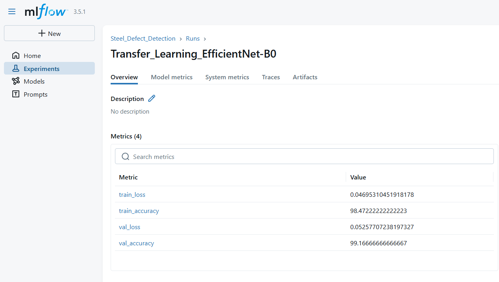
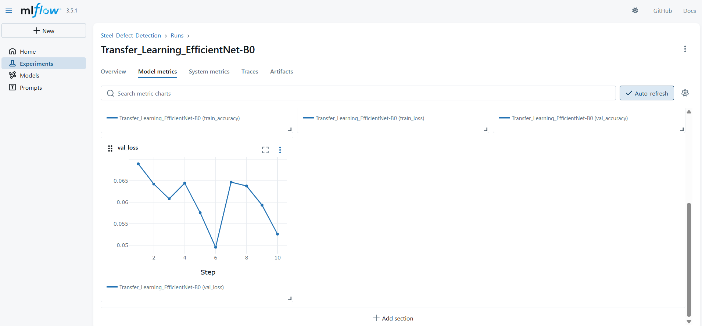
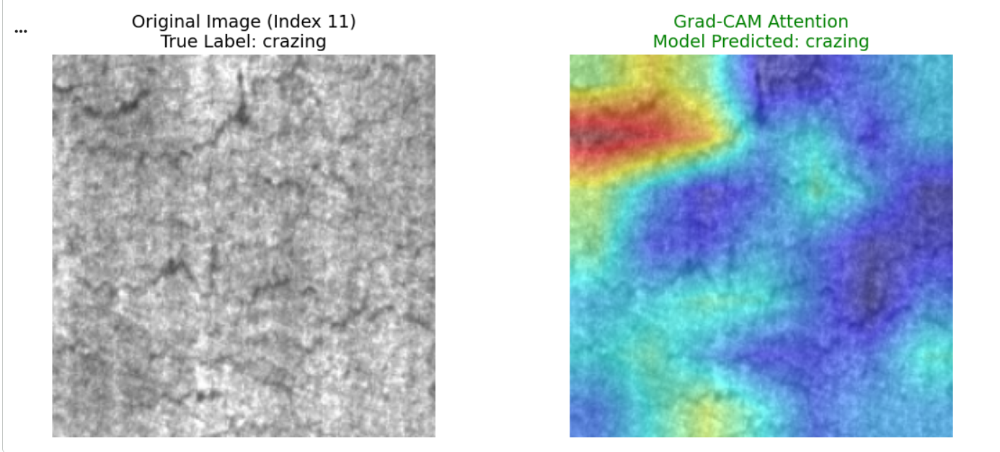
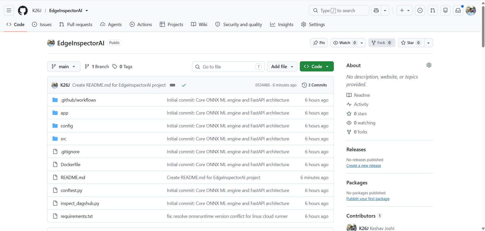
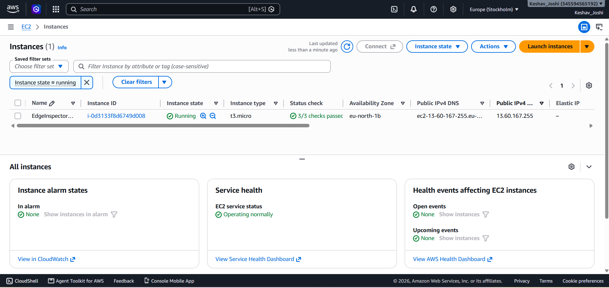

```markdown
# EdgeInspectorAI
### End-to-End Steel Defect Detection & MLOps Pipeline
---------------------------------------------------------------------------------------------------------------------------------------------------------------------------------------------------------------------------------------------------------------------------------------
## Summary
In high-stakes industrial manufacturing, automated visual inspection systems require a delicate balance between mathematical interpretability and blazing- fast production inference.

EdgeInspectorAI is a production-grade machine learning architecture designed to defect surface on steel plates. To achieve both trust and speed, this repository enforces strict "Separation of Concerns" across two distinct architectural pillers:

1. **The Diagnostic R&D Environment:** A heavy, PyTorch-based google colab notebook environment utilizing Explainable AI (GRAD-CAM) to mathematically audit feature maps and prove the model's visual intuition to stakeholders.

2. **The Production Edge API:** A heavily optimized, containerized FastAPI microservice running an ONNX execution graph. By completely stripping PyTorch from the production environment, the inference engine achieves minimal latency and and severely reduced memory footprint, deployed autonomously to an AWS EC2 instance via Continuous Integration and Deployment (CI/CD).
---------------------------------------------------------------------------------------------------------------------------------------------------------------------------------------------------------------------------------------------------------------------------------------
## Dual-Architecture Overview
### R&D & Model Explainabillity (google colab GPU Tesla T4, PyTorch)
Before trusting the model in a factory setting, we must prove why it makes decision
1. **Data**: Kaggle Dataset Nue-Surface-Defect fetched directly to the AWS s3 bucket, and then loaded in the google colab notebook using the colab secrets.
2. **Backbone:** Transfer learning via **EfficientNet-B0.**
3. **Experiment Tracking:** Hyperparameters, loss curves, and artifact registration tracked securely via remote **DagsHub MLflow**.

<p align="center">
  
</p>
<p align="center">
  
</p>

4. **Explainable AI (XAI):** Implemented via the pytorch-grad-cam library targeting the final convolutional block (model.features[-1]). Offline diagnostic routines calculate class activation maps by dynamically evaluating feature layer gradients, generating spatial heatmaps that visually verify the actual position of the defects in red color, fading the color as the defect is getting small on surface, blue means no defect at that position.

<p align="center">
  
</p>

### High-Speed Production (ONNX/FastAPI/Docker)
Heavy deep learning frameworks are unsuitable for edge hardware. The production architecture is mathematically frozen and optimized:

1. **ONNX Export:** The PyTorch model is converted into an Open Neural Network Exchange (**ONNX**) static computation graph.
2. **Dependency Pruning:** The production **requirements.txt** strictly pins **onnxruntime==1.23.2** and **fastapi**. Masive Data Science libraries (torch, pandas, matplotlib) are entirely excluded to prevent environmental pollution.
3. **Continuous Deployment (CI/CD):** A **GitHub Actions** robotic runner monitors the main branch. Upon pushing code, it automatically builds the Docker image, uploads it to Docker Hub, securely SSHs into the AWS Ubuntu server, injects environment secrets, and launches the container in detached mode.

<p align="center">
  
</p>

---------------------------------------------------------------------------------------------------------------------------------------------------------------------------------------------------------------------------------------------------------------------------------------
## Technology Stack

| Category | Tools & Frameworks |
| :--- | :--- |
| **Deep Learning** | PyTorch, Torchvision, EfficientNet-B0 |
| **Explainable AI** | Grad-CAM (Gradient-weighted Class Activation Mapping) |
| **MLOps & Tracking** | MLflow, DagsHub |
| **Inference Engine** | ONNX Runtime |
| **API & Backend** | FastAPI, Uvicorn, Python 3.12 |
| **Cloud & DevOps** | Docker, GitHub Actions, AWS EC2 (Ubuntu 24.04), AWS S3, SSH |
---------------------------------------------------------------------------------------------------------------------------------------------------------------------------------------------------------------------------------------------------------------------------------------
## API Endpoints(Live Cloud Production)
The application exposes a robust REST API for seamless integration into factory camera ststem

<p align="center">
  
</p>

1. **GET /:** Health check endpoint verifying container status and MLflow tracking connections.
2. **GET /docs:** Interactive Swagger UI for live endpoint testing.
3. **POST /predict/:** Accepts a raw image file upload (JPG/PNG),
4. dynamically pre-processes the tensor, executes the ONNX forward pass, and returns a JSON payload containing the predicted defect class and mathematical confidence score.
---------------------------------------------------------------------------------------------------------------------------------------------------------------------------------------------------------------------------------------------------------------------------------------
## Sample API Response
When an image is submitted to the `POST /predict/` endpoint, the service returns the following payload:

```json
{
  "prediction": "rolled-in_scale",
  "confidence": 0.9269,
  "class_probabilities": {
    "crazing": 0.05559999868273735,
    "inclusion": 0.0013000000035390258,
    "patches": 0,
    "pitted_surface": 0.01140000019222498,
    "rolled-in_scale": 0.9269000291824341,
    "scratches": 0.004800000227987766
  }
}

```

---

## Local Development Setup

To replicate the high-optimized production container on your local machine:

1. Clone the Repository

```bash
git clone [https://github.com/K26J/EdgeInspector_AI.git](https://github.com/K26J/EdgeInspector_AI.git)
cd EdgeInspector_AI

```

2. Environment Secrets Configuration:
Create a `.env` file in the root directory (ignored by git) and add your DagsHub credentials:

```bash
MLFLOW_TRACKING_URI="[https://dagshub.com/](https://dagshub.com/)..."
MLFLOW_TRACKING_USERNAME="..."
MLFLOW_TRACKING_PASSWORD="..."

```

3. Build and Launch the Container:

```bash
docker build -t edge-inspector-api .
docker run -p 8000:8000 --env-file .env edge-inspector-api

```

Navigate to http://localhost:8000/docs to test the API locally before pushing to the CI/CD pipeline.

Author: **Keshav Mahesh Joshi**

```

```
